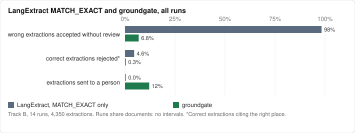

# groundgate

**LLMs propose facts. groundgate decides which ones you can trust.**

groundgate is a deterministic admission layer for LLM document extraction. You give it a
document, a schema, and the facts an extractor proposed. Every fact comes back with one of three
outcomes:

- **admitted**: every check passed;
- **needs_verification**: nothing failed, but a person should look, and the decision says where;
- **rejected**: a check failed, with a stable reason code.

Every run writes a receipt with hashes of every input. Anyone can re-derive it byte for byte.

The goal is to admit as many fields as possible with the right value, while wrong values almost
never get in. I judge every rule by two numbers: the facts admitted with a right value, and the
wrong extractions admitted (escapes). Reviews are the cost between them: each one is a value that
a person confirms by hand.


## Why this exists

Current models get most extracted values right. In the benchmark below, 4,233 of 4,350
extractions were correct. The other 117, about 1 in 37, each cited a real place in the document,
so nothing on the page tells you which ones are wrong.

Grounded extraction tools check that the quoted **text** exists in the source. They don't check
the **value** you store. LangExtract is the clearest example, and a good tool. It aligns each
`extraction_text` to the source and reports `MATCH_EXACT`, `MATCH_FUZZY` and so on. It never
looks at the attributes that hold the typed value.

A real case from the benchmark: IRS Publication 560 states two limits a few lines apart.

```text
The limit on elective deferrals, other than catch-up contributions, is $23,500 for 2025 ...
The limit on salary reduction contributions, other than catch-up contributions, is $16,500 for 2025 ...
```

The first is the 401(k) limit. The second is the SIMPLE plan limit. Asked for the 2025 elective
deferral limit, 4 of 14 runs proposed both, and LangExtract marked both quotes `MATCH_EXACT`.
groundgate sent both to a person with `CONFLICTING_CANDIDATES`, because two proposals for one
field disagree. In Publication 15-B, one model stored "$1 million" as 1, also an exact match, and
groundgate flagged it `SCALE_WORD`.

The same gap shows up on the document I used while building the library. I ran Gemini 3.6 Flash and GPT-OSS 120B through
LangExtract on two pages of IRS Publication 590-A. LangExtract aligned all 48 extractions as
`MATCH_EXACT`. groundgate then:

- **rejected** Gemini's reading of a misprinted `$252,0000` as 2,520,000;
- **flagged** two GPT-OSS facts that took a Roth IRA limit from the spousal-deduction sentence;
  the numbers match, but the text says "more than" where the field says "at least";
- **listed** a required field both models missed;
- **admitted** 44 facts, all with the right value.

One admitted fact still cites the wrong rule. Its number is correct, its comparator matches, and
no span check can tell. I checked every decision by hand; the details are in
[examples/irs-590a](examples/irs-590a), which is also the page in the screenshot.

I measured the gap on purpose before writing the library. On 51 facts from two public-domain
government documents, LangExtract's strictest setting (`MATCH_EXACT` only) accepted **100%** of
planted value and unit errors whose quote was correct. groundgate caught **all** of them and
rejected **none** of the correct facts. The method and full tables are in
[spikes/m0_5](spikes/m0_5/README.md).

LangExtract locates the text. groundgate checks the number in it.

## Benchmark

Seven models (Gemini, GPT and Claude, each through its own CLI) ran through LangExtract on 30
public-domain FDA drug labels, NTSB accident reports and IRS publications, at two chunk sizes. A
person checked every gold fact. These are spec 0.1's numbers on the first set, as published. Of 4,350 extractions, 117 were wrong: the wrong value, a value
for a field the document doesn't state, the wrong unit, or not a number.



| | LangExtract, `MATCH_EXACT` | groundgate |
|---|---:|---:|
| wrong extractions accepted without review | 98.3% (115/117) | 6.8% (8/117) |
| correct extractions citing the right place, rejected | 4.6% (194/4,233) | 0.3% (14/4,233) |
| extractions sent to a person | 0% | 12.1% (526/4,350) |
| gold facts admitted with a right value | 92.5% (3,588/3,878) | 87.1% (3,379/3,878) |

A gold fact is one value that a document states for a field, so a field with 12 strengths counts
12 times, and each fact counts once in each run. groundgate admits fewer right facts than
`MATCH_EXACT`, and lets in 8 wrong values instead of 115. With the reviews, 96.5% (3,742/3,878)
of gold facts get a right value.

Of the 526 extractions groundgate sent to a person, 92 were wrong; a random sample that size
would have held about 14. groundgate also rejected 71 correct values that LangExtract had aligned
to a place that doesn't state them: the value was right, the evidence wasn't.

Most catches (84 of 109) were `CONFLICTING_CANDIDATES`: a model proposed two values for a
single-valued field, and groundgate sent both to review instead of picking one.

Six of the 8 that got through are the case groundgate says it cannot catch (see
[What it does not do](#what-it-does-not-do)). Five models took metoprolol's heart failure maximum
(200 mg) as the hypertension maximum, and one took lisinopril's renal impairment dose as the usual
starting dose. Each number is real and cited correctly; it belongs to another condition. The
other two read levothyroxine's 1.6 mcg/kg/day as a flat 1.6 mcg, which the unit check allows.
Putting all seven models through one gate caught one more, because when they were wrong they
mostly agreed. Spec 0.2 goes after both: keyed fields check the condition, and a dose per
kilogram no longer passes as a flat dose.

The benchmark also found a bug. When LangExtract's chunker cut "29.97" after "29.", groundgate
read the span as 29, which its own spec forbids. It's fixed, and three wrong altimeter settings no
longer get through.

Tables and planted-error results: [bench/RESULTS.md](bench/RESULTS.md). Method and caveats:
[bench/README.md](bench/README.md). The write-up, with what got through and why:
[Grounding is a contract, not a citation](https://mohanraj00.github.io/tech/grounding-is-a-contract/).

### Spec 0.2 on a second set

Spec 0.2's rules were written from the escapes above, so they can't be measured on the same
documents. I picked 101 new ones by rules frozen before anyone read them: FDA labels with doses
per indication or per kilogram, IRS publications and Federal Register rules with "increased from",
"must not be more than" and "$1.2 million". The same seven models ran at both chunk sizes. Every
candidate was decided twice, by spec 0.1 (the released 0.1.0 wheel) and by spec 0.2. Pooled over
14 runs on the 74 documents checked in full:

| | LangExtract, `MATCH_EXACT` | groundgate, spec 0.1 | groundgate, spec 0.2 |
|---|---:|---:|---:|
| wrong extractions accepted without review | 85.7% (705/823) | 30.7% (253/823) | 8.8% (72/823) |
| correct extractions citing the right place, rejected | 3.8% (230/6,080) | 11.3% (690/6,080) | 0.5% (28/6,080) |
| extractions sent to a person | 0% | 28.2% (1,950/6,903) | 39.6% (2,730/6,903) |
| gold facts admitted with a right value | 84.6% (4,751/5,614) | 51.0% (2,862/5,614) | 53.2% (2,985/5,614) |

642 of 0.1's 690 false rejects are in the 19 documents picked for amounts like "$1.2 million",
which 0.1 could not match. 82 of its 253 escapes were a right value under the wrong indication;
0.2 lets 10 of those through. It pays in review load. The 72 that still got through are listed
one by one in [bench/set2/RESULTS.md](bench/set2/RESULTS.md), and two rules that need work are
open for the next version (#51, #52).

This set shows the gap that matters most. Spec 0.2 admits a right value for 53.2% of gold facts,
and the reviews bring it to 86.8% (4,873/5,614). Closing that gap without new escapes is the work
of the next versions: the 0.4 key clear and a basis that the extractor states (#125) both aim at
it.

## Quickstart

```bash
pip install groundgate
```

```python
import groundgate as gg

text = "The IRA contribution limit is $7,000. The deduction phases out above $79,000."
schema = {
    "fields": {
        "ira_limit": {"type": "integer", "unit": "USD"},
        "phaseout_start": {"type": "integer", "unit": "USD"},
    }
}


def cite(field, value, quote):
    """A candidate citing the first place `quote` appears, as UTF-8 byte offsets."""
    start = text.encode().index(quote.encode())
    span = {"start": start, "end": start + len(quote.encode()), "text": quote}
    return {"field": field, "value": value, "unit": "USD", "evidence": span}


candidates = [
    cite("ira_limit", "7000", "$7,000"),
    cite("ira_limit", "70000", "$7,000"),  # a digit too many
    cite("phaseout_start", "79000", "$79,000"),  # "above" is not "at"
]
receipt = gg.admit(text, schema, candidates)
for d in receipt.decisions:
    print(f"{d.outcome:<19} {d.field:<15} {d.value:<6} {' '.join(d.codes)}".rstrip())

print(gg.verify(receipt.to_dict(), text, schema, candidates).ok)
```

```text
admitted            ira_limit       7000
rejected            ira_limit       70000  VALUE_NOT_IN_EVIDENCE
needs_verification  phaseout_start  79000  QUALIFIED_VALUE
True
```

The core has no dependencies. `groundgate[pdf]` adds pdfminer.six for PDF text, and
`groundgate[langextract]` installs LangExtract. [docs/guide.md](docs/guide.md) covers schemas,
policies, candidates and the Python API.

### With LangExtract

```python
import langextract as lx
from groundgate.adapters.langextract import admit_document

result = lx.extract(text_or_documents=text, prompt_description=prompt, examples=examples)
receipt = admit_document(result, schema)
```

Each extraction's `value` and `unit` attributes are checked at the place LangExtract aligned its
`extraction_text`. An extraction LangExtract could not align is rejected `NO_EVIDENCE`.

### From the command line

```bash
groundgate extract p590a.pdf --pages 1-2 -o doc.txt --layout layout.json
groundgate admit   doc.txt schema.json candidates.json -o receipt.json
groundgate verify  receipt.json doc.txt schema.json candidates.json
groundgate report  receipt.json doc.txt schema.json candidates.json --layout layout.json -o report.html
```

`extract` turns a PDF, HTML, XML or text file into the NFC text everything else reads, and
records the page and box of every word. Text a reader can't see (proof marks drawn off the page,
hidden HTML) is dropped, and superscripts are marked so that 10⁹ reads `10^9`, never `109`. Pass
`-` as the document to read it from a pipe. `report` refuses to render a receipt that doesn't
re-derive from its inputs. [examples/irs-590a](examples/irs-590a) runs the whole pipeline on an
IRS publication with cached model output, so it reproduces without an API key.

## What it checks

Checks run in a fixed order. The first failure rejects the fact.

| Code | Rejects when |
|---|---|
| `CANDIDATE_INVALID` | the candidate is malformed |
| `FIELD_UNKNOWN` | the field is not in the schema |
| `NULL_STRING_LITERAL` | the value is `"null"`, `"none"`, `"n/a"` |
| `TYPE_INVALID` | the value does not parse as the field's type |
| `RANGE_INVALID` | the value is outside the field's bounds |
| `UNIT_INVALID` | the unit is not the field's unit |
| `KEY_INVALID` | the field is keyed by condition, and the key is missing or not one of its keys |
| `NO_EVIDENCE` | no evidence is cited |
| `SPAN_INVALID` | the span is outside the document or splits a character |
| `QUOTE_NOT_FOUND` | the quoted value text is not in the document, or in the reference it cites |
| `VALUE_NOT_IN_EVIDENCE` | no number in the span equals the value, with the sign and scale the evidence gives |
| `UNIT_NOT_IN_EVIDENCE` | the value is there, but with another unit |
| `SOURCE_REJECTED` | only outside evidence supports the value, and the policy rejects it |

A fact that passes every check can still be flagged for a person:

| Code | Flags when |
|---|---|
| `NON_VERBATIM_EVIDENCE` | the quote differs from the text at the span |
| `QUALIFIED_VALUE` | "up to", "approximately", "or more" changes the value, and the schema didn't declare it |
| `SCALE_WORD` | "million", "lakh" and similar follow the value, and the value was given unscaled |
| `PART_MISSING` | the value needs a sign, a scale or a unit that no evidence item supports |
| `SIGN_CITATION_INVALID`, `SCALE_CITATION_INVALID`, `UNIT_CITATION_INVALID`, `FIELD_CITATION_INVALID` | a cited part fails its check |
| `KEY_NOT_AT_VALUE` | the text puts the value under another condition, such as another indication's heading |
| `KEY_CITATION_INVALID` | the cited key item does not name the key |
| `EVIDENCE_QUOTED`, `EVIDENCE_STATED` | only an external quote, or the extractor's own knowledge, supports the value |
| `LOW_CONFIDENCE` | the extractor's confidence is below the policy minimum |
| `CONFLICTING_CANDIDATES` | another proposal for the same field and key has a different value |

Number matching is collision-safe. The span `500 mg` inside `1,500 mg` never reads as 500, a span
that stops at `29.` inside `29.97` never reads as 29, and a malformed number like the `$252,0000`
printed in IRS Publication 590-A never equals 252,000 or 2,520,000. When a span misses the value
but its quote occurs exactly once elsewhere with the right value and unit, groundgate moves the
evidence there and records `EVIDENCE_REANCHORED`.

The rules are in [SPEC.md](SPEC.md). [conformance/](conformance) holds 31 language-neutral
vectors that pin every code, so another implementation can prove it agrees.

## Receipts

```json
{"groundgate": "0.5",
 "document": {"id": "irs-p590a-2025-pages-1-2", "sha256": "sha256:2fb2495b5dfb...", "source": null},
 "references": [],
 "schema_sha256": "sha256:...", "policy_sha256": "sha256:...",
 "decisions": [{"candidate_id": "Gemini_3.6_Flash_Medium/0", "field": "ira_limit_2025",
                "outcome": "admitted", "codes": [], "value": "7000", "unit": "USD",
                "source": "document", "ref": null, "url": null,
                "evidence": {"start": 2317, "end": 2323}, "parts": [], "missing": [],
                "candidate_sha256": "sha256:a15c9d8b..."},
               "..."],
 "coverage": [{"field": "roth_phaseout_single_2025_end", "code": "REQUIRED_FIELD_MISSING"}],
 "judgments": [],
 "summary": {"admitted": 44, "needs_verification": 3, "rejected": 1},
 "receipt_sha256": "sha256:..."}
```

Hashes are SHA-256 over RFC 8785 canonical JSON, so a receipt means the same thing in any
language. `groundgate verify` re-runs every decision from the inputs and fails on any difference:
a changed document, schema, policy, candidate or outcome.

## What it does not do

- **It does not judge meaning.** If the model reports a number that really is in the sentence but
  belongs to another field, every span check passes: a model that reads an age-50 limit of $8,000
  as the IRA limit cites a real "$8,000" with the right unit. A second proposer plus
  `CONFLICTING_CANDIDATES` catches it only when the models disagree, and in the benchmark they
  mostly agreed: six of the eight escapes were this case. When the field depends on a condition
  the schema can name, such as a drug's indications, a keyed field checks it (spec 0.2).
- **No dates, arrays of records, or cross-document checks** in spec 0.4.
- **English number formats only.** A decimal comma (`1.234,56`), space groups (`1 234`) and
  number words (`five`) have no value, so a fact that cites them is rejected. The
  [guide](docs/guide.md#how-values-are-read) lists what is read. Locale packs for other formats
  are a design ([docs/design/locale-packs.md](docs/design/locale-packs.md), #60).
- **No OCR.** Scanned PDFs need a text layer first (for example `ocrmypdf`).
- **No model calls in the decision.** groundgate never asks an LLM whether an LLM was right. Spec
  0.4 reads a judge's answers only as recorded inputs, so a receipt still re-derives byte for
  byte. This judge block is experimental: its one measure on real extractor output is the key
  clear on 10-K filings (#120). `groundgate-calibrate` (#112) measures the thresholds on your own
  documents.

## Status

Alpha. groundgate 0.4.0 implements spec v0.4. [CHANGELOG.md](CHANGELOG.md) lists what each
version changes, with its measure. 0.4 adds recorded judgments (#116), an experimental way for a
judge's answers to clear a key flag or add doubt, with no model call in the decision. 0.3 brought
a wider change rule (#51), abbreviation dots that no longer end a sentence for qualifiers (#63,
#77), Indian digit grouping (#59), ASCII digits (#94), and keys that stop at a label line (#52) or
read a table by its lines (#87). A receipt names the spec
version it was decided under, and only that version verifies it.

[Locale packs](docs/design/locale-packs.md) for number formats outside English are a design,
not yet code. Of the [hybrid decisions](docs/design/hybrid-decisions.md) design, 0.4 has the
recorded judgments for the key and field questions. The audit sample and model-proposed
locations are not code yet.

## License

Apache-2.0.
