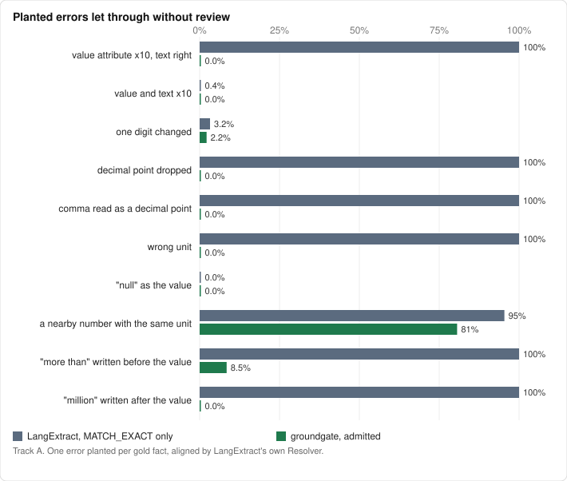
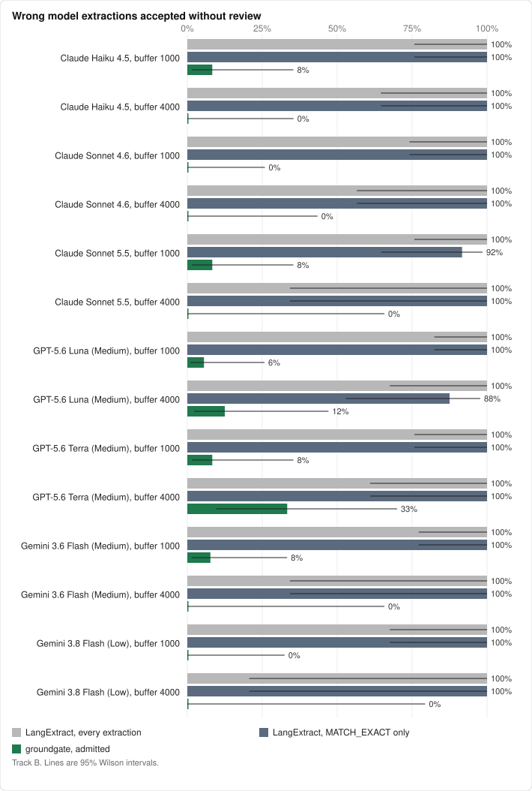

# Benchmark results

> **Draft gold.** These numbers score against model-written labels that no person
> has checked yet. They are for development only.

Generated by `bench/score.py` from the cached runs in `bench/runs`. [bench/README.md](README.md) explains the method.

Gold: 30 documents, 276 facts, 34 fields confirmed absent (draft (model-written, not yet checked by a person)).

## Track A: planted errors

**Correct extractions (higher is better).** Share accepted without review.

| Planted | n | LangExtract, all | aligned | MATCH_EXACT | groundgate admitted | review | rejected |
|---|---:|---:|---:|---:|---:|---:|---:|
| correct value, verbatim text | 276 | 100.0% | 100.0% | 100.0% | 91.3% | 7.6% | 1.1% |
| correct value, paraphrased text | 276 | 100.0% | 64.5% | 1.1% | 1.1% | 60.1% | 38.8% |

**Errors in the extraction (lower is better).** Share accepted without review.

| Planted | n | LangExtract, all | aligned | MATCH_EXACT | groundgate admitted | review | rejected |
|---|---:|---:|---:|---:|---:|---:|---:|
| value attribute x10, text right | 275 | 100.0% | 100.0% | 100.0% | 0.0% | 0.0% | 100.0% |
| value and text x10 | 275 | 100.0% | 25.5% | 0.4% | 0.0% | 0.0% | 100.0% |
| one digit changed | 276 | 100.0% | 44.9% | 3.3% | 2.2% | 0.7% | 97.1% |
| decimal point dropped (0.4 read as 4) | 20 | 100.0% | 100.0% | 100.0% | 0.0% | 0.0% | 100.0% |
| comma read as a decimal point (184,500 as 184.5) | 87 | 100.0% | 100.0% | 100.0% | 0.0% | 0.0% | 100.0% |
| wrong unit | 256 | 100.0% | 100.0% | 100.0% | 0.0% | 0.0% | 100.0% |
| "null" as the value | 276 | 100.0% | 0.0% | 0.0% | 0.0% | 0.0% | 100.0% |
| a nearby number with the same unit | 195 | 100.0% | 98.5% | 95.9% | 81.0% | 15.9% | 3.1% |

**Errors in meaning: the text qualifies the value (lower is better).** Share accepted without review.

| Planted | n | LangExtract, all | aligned | MATCH_EXACT | groundgate admitted | review | rejected |
|---|---:|---:|---:|---:|---:|---:|---:|
| "more than" written before the value | 271 | 100.0% | 100.0% | 100.0% | 8.1% | 91.1% | 0.7% |
| "million" written after the value | 114 | 100.0% | 100.0% | 100.0% | 0.0% | 99.1% | 0.9% |

All 22 admitted here cite another place where the same text appears without the planted word. LangExtract aligned the quote there, and that place does state the value.

## Track B: real model runs

| Run | docs | candidates | wrong | escaped, LangExtract all | escaped, MATCH_EXACT | escaped, groundgate | wrong sent to review | false rejects | review load | recall, admitted | recall, admitted or review |
|---|---:|---:|---:|---:|---:|---:|---:|---:|---:|---:|---:|
| Claude Haiku 4.5 @ 1000 | 30 | 336 | 12 | 100.0% (12/12) | 100.0% (12/12) | 8.3% (1/12) [1, 35] | 91.7% (11/12) | 0.3% (1/324) | 16.4% (55/336) | 84.4% (233/276) | 96.4% (266/276) |
| Claude Haiku 4.5 @ 4000 | 30 | 292 | 8 | 100.0% (8/8) | 100.0% (8/8) | 0.0% (0/8) [0, 32] | 50.0% (4/8) | 0.7% (2/284) | 11.3% (33/292) | 87.3% (241/276) | 97.5% (269/276) |
| Claude Sonnet 4.6 @ 1000 | 30 | 336 | 11 | 100.0% (11/11) | 100.0% (11/11) | 0.0% (0/11) [0, 26] | 81.8% (9/11) | 0.3% (1/325) | 14.3% (48/336) | 87.7% (242/276) | 97.8% (270/276) |
| Claude Sonnet 4.6 @ 4000 | 30 | 294 | 6 | 100.0% (6/6) | 100.0% (6/6) | 0.0% (0/6) [0, 39] | 33.3% (2/6) | 0.4% (1/288) | 9.2% (27/294) | 89.9% (248/276) | 98.6% (272/276) |
| Claude Sonnet 5.5 @ 1000 | 30 | 343 | 13 | 100.0% (13/13) | 92.3% (12/13) | 7.7% (1/13) [1, 33] | 84.6% (11/13) | 0.3% (1/330) | 13.7% (47/343) | 89.1% (246/276) | 98.9% (273/276) |
| Claude Sonnet 5.5 @ 4000 | 30 | 289 | 2 | 100.0% (2/2) | 100.0% (2/2) | 0.0% (0/2) [0, 66] | 100.0% (2/2) | 0.4% (1/287) | 10.0% (29/289) | 89.5% (247/276) | 98.9% (273/276) |
| GPT-5.6 Luna (Medium) @ 1000 | 30 | 340 | 18 | 100.0% (18/18) | 100.0% (18/18) | 5.6% (1/18) [1, 26] | 88.9% (16/18) | 0.0% (0/322) | 16.8% (57/340) | 85.1% (235/276) | 96.7% (267/276) |
| GPT-5.6 Luna (Medium) @ 4000 | 30 | 288 | 8 | 100.0% (8/8) | 87.5% (7/8) | 12.5% (1/8) [2, 47] | 37.5% (3/8) | 0.4% (1/280) | 9.7% (28/288) | 87.3% (241/276) | 96.0% (265/276) |
| GPT-5.6 Terra (Medium) @ 1000 | 30 | 311 | 12 | 100.0% (12/12) | 100.0% (12/12) | 8.3% (1/12) [1, 35] | 91.7% (11/12) | 0.0% (0/299) | 15.4% (48/311) | 80.8% (223/276) | 91.3% (252/276) |
| GPT-5.6 Terra (Medium) @ 4000 | 30 | 281 | 6 | 100.0% (6/6) | 100.0% (6/6) | 33.3% (2/6) [10, 70] | 50.0% (3/6) | 0.0% (0/275) | 10.0% (28/281) | 85.9% (237/276) | 94.6% (261/276) |
| Gemini 3.6 Flash (Medium) @ 1000 | 30 | 343 | 13 | 100.0% (13/13) | 100.0% (13/13) | 7.7% (1/13) [1, 33] | 76.9% (10/13) | 0.0% (0/330) | 12.8% (44/343) | 89.5% (247/276) | 98.6% (272/276) |
| Gemini 3.6 Flash (Medium) @ 4000 | 30 | 288 | 2 | 100.0% (2/2) | 100.0% (2/2) | 0.0% (0/2) [0, 66] | 50.0% (1/2) | 0.4% (1/286) | 7.3% (21/288) | 90.2% (249/276) | 97.1% (268/276) |
| Gemini 3.8 Flash (Low) @ 1000 | 30 | 330 | 8 | 100.0% (8/8) | 100.0% (8/8) | 0.0% (0/8) [0, 32] | 100.0% (8/8) | 0.3% (1/322) | 12.1% (40/330) | 88.4% (244/276) | 97.5% (269/276) |
| Gemini 3.8 Flash (Low) @ 4000 | 30 | 279 | 1 | 100.0% (1/1) | 100.0% (1/1) | 0.0% (0/1) [0, 79] | 100.0% (1/1) | 0.4% (1/278) | 7.5% (21/279) | 89.1% (246/276) | 96.0% (265/276) |

### What the wrong extractions were

| Run | wrong value | field absent from the document | wrong unit | not a number |
|---|---:|---:|---:|---:|
| Claude Haiku 4.5 @ 1000 | 11 | 1 | 0 | 0 |
| Claude Haiku 4.5 @ 4000 | 7 | 1 | 0 | 0 |
| Claude Sonnet 4.6 @ 1000 | 11 | 0 | 0 | 0 |
| Claude Sonnet 4.6 @ 4000 | 4 | 2 | 0 | 0 |
| Claude Sonnet 5.5 @ 1000 | 11 | 2 | 0 | 0 |
| Claude Sonnet 5.5 @ 4000 | 2 | 0 | 0 | 0 |
| GPT-5.6 Luna (Medium) @ 1000 | 15 | 2 | 0 | 1 |
| GPT-5.6 Luna (Medium) @ 4000 | 6 | 1 | 0 | 1 |
| GPT-5.6 Terra (Medium) @ 1000 | 11 | 1 | 0 | 0 |
| GPT-5.6 Terra (Medium) @ 4000 | 5 | 1 | 0 | 0 |
| Gemini 3.6 Flash (Medium) @ 1000 | 10 | 2 | 0 | 1 |
| Gemini 3.6 Flash (Medium) @ 4000 | 2 | 0 | 0 | 0 |
| Gemini 3.8 Flash (Low) @ 1000 | 8 | 0 | 0 | 0 |
| Gemini 3.8 Flash (Low) @ 4000 | 1 | 0 | 0 | 0 |

### What stopped them

The first reason code on each wrong extraction groundgate rejected or sent to review.

| Run | `CONFLICTING_CANDIDATES` | `QUALIFIED_VALUE` | `SCALE_WORD` | `TYPE_INVALID` | `UNIT_INVALID` | `UNIT_NOT_IN_EVIDENCE` | `VALUE_NOT_IN_EVIDENCE` |
|---|---:|---:|---:|---:|---:|---:|---:|
| Claude Haiku 4.5 @ 1000 | 10 | 1 | 0 | 0 | 0 | 0 | 0 |
| Claude Haiku 4.5 @ 4000 | 4 | 0 | 0 | 0 | 0 | 1 | 3 |
| Claude Sonnet 4.6 @ 1000 | 8 | 1 | 0 | 0 | 0 | 0 | 2 |
| Claude Sonnet 4.6 @ 4000 | 2 | 0 | 0 | 0 | 1 | 1 | 2 |
| Claude Sonnet 5.5 @ 1000 | 10 | 1 | 0 | 0 | 0 | 1 | 0 |
| Claude Sonnet 5.5 @ 4000 | 2 | 0 | 0 | 0 | 0 | 0 | 0 |
| GPT-5.6 Luna (Medium) @ 1000 | 14 | 2 | 0 | 1 | 0 | 0 | 0 |
| GPT-5.6 Luna (Medium) @ 4000 | 3 | 0 | 0 | 1 | 0 | 1 | 2 |
| GPT-5.6 Terra (Medium) @ 1000 | 10 | 0 | 1 | 0 | 0 | 0 | 0 |
| GPT-5.6 Terra (Medium) @ 4000 | 2 | 0 | 1 | 0 | 0 | 0 | 1 |
| Gemini 3.6 Flash (Medium) @ 1000 | 9 | 1 | 0 | 1 | 1 | 0 | 0 |
| Gemini 3.6 Flash (Medium) @ 4000 | 1 | 0 | 0 | 0 | 0 | 0 | 1 |
| Gemini 3.8 Flash (Low) @ 1000 | 8 | 0 | 0 | 0 | 0 | 0 | 0 |
| Gemini 3.8 Flash (Low) @ 4000 | 1 | 0 | 0 | 0 | 0 | 0 | 0 |

### Right value, wrong place

Correct values groundgate admitted whose evidence does not overlap any gold evidence span, and correct values rejected because LangExtract aligned them to the wrong place.

| Run | admitted, cited elsewhere | rejected, cited elsewhere |
|---|---:|---:|
| Claude Haiku 4.5 @ 1000 | 14.2% (38/267) | 3.7% (12/324) |
| Claude Haiku 4.5 @ 4000 | 10.0% (25/251) | 0.7% (2/284) |
| Claude Sonnet 4.6 @ 1000 | 13.6% (37/273) | 3.7% (12/325) |
| Claude Sonnet 4.6 @ 4000 | 10.4% (27/260) | 0.7% (2/288) |
| Claude Sonnet 5.5 @ 1000 | 16.2% (47/290) | 0.9% (3/330) |
| Claude Sonnet 5.5 @ 4000 | 9.7% (25/258) | 0.4% (1/287) |
| GPT-5.6 Luna (Medium) @ 1000 | 14.8% (40/270) | 3.4% (11/322) |
| GPT-5.6 Luna (Medium) @ 4000 | 10.8% (27/251) | 1.1% (3/280) |
| GPT-5.6 Terra (Medium) @ 1000 | 15.2% (38/250) | 4.0% (12/299) |
| GPT-5.6 Terra (Medium) @ 4000 | 9.7% (24/247) | 1.1% (3/275) |
| Gemini 3.6 Flash (Medium) @ 1000 | 17.1% (50/293) | 0.9% (3/330) |
| Gemini 3.6 Flash (Medium) @ 4000 | 11.0% (29/264) | 0.4% (1/286) |
| Gemini 3.8 Flash (Low) @ 1000 | 15.8% (45/284) | 1.6% (5/322) |
| Gemini 3.8 Flash (Low) @ 4000 | 11.3% (29/256) | 0.4% (1/278) |

### By source

| Run | source | wrong | escaped, MATCH_EXACT | escaped, groundgate |
|---|---|---:|---:|---:|
| Claude Haiku 4.5 @ 1000 | fda | 8 | 100.0% (8/8) | 12.5% (1/8) |
| Claude Haiku 4.5 @ 1000 | ntsb | 4 | 100.0% (4/4) | 0.0% (0/4) |
| Claude Haiku 4.5 @ 4000 | fda | 2 | 100.0% (2/2) | 0.0% (0/2) |
| Claude Haiku 4.5 @ 4000 | ntsb | 4 | 100.0% (4/4) | 0.0% (0/4) |
| Claude Haiku 4.5 @ 4000 | irs | 2 | 100.0% (2/2) | 0.0% (0/2) |
| Claude Sonnet 4.6 @ 1000 | fda | 5 | 100.0% (5/5) | 0.0% (0/5) |
| Claude Sonnet 4.6 @ 1000 | ntsb | 6 | 100.0% (6/6) | 0.0% (0/6) |
| Claude Sonnet 4.6 @ 4000 | fda | 3 | 100.0% (3/3) | 0.0% (0/3) |
| Claude Sonnet 4.6 @ 4000 | ntsb | 3 | 100.0% (3/3) | 0.0% (0/3) |
| Claude Sonnet 5.5 @ 1000 | fda | 9 | 88.9% (8/9) | 11.1% (1/9) |
| Claude Sonnet 5.5 @ 1000 | ntsb | 4 | 100.0% (4/4) | 0.0% (0/4) |
| Claude Sonnet 5.5 @ 4000 | fda | 1 | 100.0% (1/1) | 0.0% (0/1) |
| Claude Sonnet 5.5 @ 4000 | ntsb | 1 | 100.0% (1/1) | 0.0% (0/1) |
| GPT-5.6 Luna (Medium) @ 1000 | fda | 9 | 100.0% (9/9) | 11.1% (1/9) |
| GPT-5.6 Luna (Medium) @ 1000 | ntsb | 5 | 100.0% (5/5) | 0.0% (0/5) |
| GPT-5.6 Luna (Medium) @ 1000 | irs | 4 | 100.0% (4/4) | 0.0% (0/4) |
| GPT-5.6 Luna (Medium) @ 4000 | fda | 3 | 100.0% (3/3) | 33.3% (1/3) |
| GPT-5.6 Luna (Medium) @ 4000 | ntsb | 2 | 100.0% (2/2) | 0.0% (0/2) |
| GPT-5.6 Luna (Medium) @ 4000 | irs | 3 | 66.7% (2/3) | 0.0% (0/3) |
| GPT-5.6 Terra (Medium) @ 1000 | fda | 7 | 100.0% (7/7) | 14.3% (1/7) |
| GPT-5.6 Terra (Medium) @ 1000 | ntsb | 4 | 100.0% (4/4) | 0.0% (0/4) |
| GPT-5.6 Terra (Medium) @ 1000 | irs | 1 | 100.0% (1/1) | 0.0% (0/1) |
| GPT-5.6 Terra (Medium) @ 4000 | fda | 2 | 100.0% (2/2) | 100.0% (2/2) |
| GPT-5.6 Terra (Medium) @ 4000 | ntsb | 1 | 100.0% (1/1) | 0.0% (0/1) |
| GPT-5.6 Terra (Medium) @ 4000 | irs | 3 | 100.0% (3/3) | 0.0% (0/3) |
| Gemini 3.6 Flash (Medium) @ 1000 | fda | 8 | 100.0% (8/8) | 12.5% (1/8) |
| Gemini 3.6 Flash (Medium) @ 1000 | ntsb | 4 | 100.0% (4/4) | 0.0% (0/4) |
| Gemini 3.6 Flash (Medium) @ 1000 | irs | 1 | 100.0% (1/1) | 0.0% (0/1) |
| Gemini 3.6 Flash (Medium) @ 4000 | fda | 1 | 100.0% (1/1) | 0.0% (0/1) |
| Gemini 3.6 Flash (Medium) @ 4000 | ntsb | 1 | 100.0% (1/1) | 0.0% (0/1) |
| Gemini 3.8 Flash (Low) @ 1000 | fda | 4 | 100.0% (4/4) | 0.0% (0/4) |
| Gemini 3.8 Flash (Low) @ 1000 | ntsb | 4 | 100.0% (4/4) | 0.0% (0/4) |
| Gemini 3.8 Flash (Low) @ 4000 | fda | 1 | 100.0% (1/1) | 0.0% (0/1) |

### Harness

Chunks whose reply LangExtract could not parse are skipped by `lx.extract` and count against recall. Codex replies that used a tool, and Claude Code replies from another model or with more than one turn, were discarded and retried.

| Run | provider | chunks | unusable replies | replies discarded by the harness check | seconds per document |
|---|---|---:|---:|---:|---:|
| Claude Haiku 4.5 @ 1000 | claude-cli | 248 | 32 | 0 | 42 |
| Claude Haiku 4.5 @ 4000 | claude-cli | 72 | 4 | 0 | 33 |
| Claude Sonnet 4.6 @ 1000 | claude-cli | 248 | 28 | 0 | 34 |
| Claude Sonnet 4.6 @ 4000 | claude-cli | 72 | 2 | 0 | 13 |
| Claude Sonnet 5.5 @ 1000 | claude-cli | 248 | 1 | 0 | 16 |
| Claude Sonnet 5.5 @ 4000 | claude-cli | 72 | 0 | 0 | 7 |
| GPT-5.6 Luna (Medium) @ 1000 | codex | 248 | 0 | 0 | 22 |
| GPT-5.6 Luna (Medium) @ 4000 | codex | 72 | 0 | 0 | 14 |
| GPT-5.6 Terra (Medium) @ 1000 | codex | 248 | 1 | 0 | 20 |
| GPT-5.6 Terra (Medium) @ 4000 | codex | 72 | 1 | 0 | 10 |
| Gemini 3.6 Flash (Medium) @ 1000 | agy | 248 | 0 | 0 | 166 |
| Gemini 3.6 Flash (Medium) @ 4000 | agy | 72 | 0 | 0 | 46 |
| Gemini 3.8 Flash (Low) @ 1000 | agy | 248 | 0 | 0 | 137 |
| Gemini 3.8 Flash (Low) @ 4000 | agy | 72 | 0 | 0 | 47 |

### Several models through one gate

Each group's candidates go into one `admit` call per document, so a disagreement on a single-valued field is flagged `CONFLICTING_CANDIDATES`. "Separately" admits the same candidates one model at a time. Pairs at 4,000 characters are in results.json.

| Models | docs | wrong | escaped, together | escaped, separately | review load, together | review load, separately | recall, admitted |
|---|---:|---:|---:|---:|---:|---:|---:|
| Claude Haiku 4.5 + Claude Sonnet 4.6 @ 1000 | 30 | 23 | 4.3% (1/23) [1, 21] | 4.3% (1/23) | 15.6% (105/672) | 15.3% (103/672) | 87.7% (242/276) |
| Claude Haiku 4.5 + Claude Sonnet 5.5 @ 1000 | 30 | 25 | 8.0% (2/25) [2, 25] | 8.0% (2/25) | 15.2% (103/679) | 15.0% (102/679) | 88.8% (245/276) |
| Claude Haiku 4.5 + GPT-5.6 Luna (Medium) @ 1000 | 30 | 30 | 6.7% (2/30) [2, 21] | 6.7% (2/30) | 17.5% (118/676) | 16.6% (112/676) | 86.2% (238/276) |
| Claude Haiku 4.5 + GPT-5.6 Terra (Medium) @ 1000 | 30 | 24 | 8.3% (2/24) [2, 26] | 8.3% (2/24) | 16.4% (106/647) | 15.9% (103/647) | 88.0% (243/276) |
| Claude Haiku 4.5 + Gemini 3.6 Flash (Medium) @ 1000 | 30 | 25 | 8.0% (2/25) [2, 25] | 8.0% (2/25) | 14.9% (101/679) | 14.6% (99/679) | 88.8% (245/276) |
| Claude Haiku 4.5 + Gemini 3.8 Flash (Low) @ 1000 | 30 | 20 | 5.0% (1/20) [1, 24] | 5.0% (1/20) | 14.7% (98/666) | 14.3% (95/666) | 88.4% (244/276) |
| Claude Sonnet 4.6 + Claude Sonnet 5.5 @ 1000 | 30 | 24 | 4.2% (1/24) [1, 20] | 4.2% (1/24) | 14.1% (96/679) | 14.0% (95/679) | 89.1% (246/276) |
| Claude Sonnet 4.6 + GPT-5.6 Luna (Medium) @ 1000 | 30 | 29 | 3.5% (1/29) [1, 17] | 3.5% (1/29) | 16.0% (108/676) | 15.5% (105/676) | 87.3% (241/276) |
| Claude Sonnet 4.6 + GPT-5.6 Terra (Medium) @ 1000 | 30 | 23 | 4.3% (1/23) [1, 21] | 4.3% (1/23) | 14.8% (96/647) | 14.8% (96/647) | 88.4% (244/276) |
| Claude Sonnet 4.6 + Gemini 3.6 Flash (Medium) @ 1000 | 30 | 24 | 4.2% (1/24) [1, 20] | 4.2% (1/24) | 13.6% (92/679) | 13.6% (92/679) | 89.5% (247/276) |
| Claude Sonnet 4.6 + Gemini 3.8 Flash (Low) @ 1000 | 30 | 19 | 0.0% (0/19) [0, 17] | 0.0% (0/19) | 13.7% (91/666) | 13.2% (88/666) | 89.1% (246/276) |
| Claude Sonnet 5.5 + GPT-5.6 Luna (Medium) @ 1000 | 30 | 31 | 6.5% (2/31) [2, 21] | 6.5% (2/31) | 16.0% (109/683) | 15.2% (104/683) | 88.0% (243/276) |
| Claude Sonnet 5.5 + GPT-5.6 Terra (Medium) @ 1000 | 30 | 25 | 8.0% (2/25) [2, 25] | 8.0% (2/25) | 14.8% (97/654) | 14.5% (95/654) | 89.1% (246/276) |
| Claude Sonnet 5.5 + Gemini 3.6 Flash (Medium) @ 1000 | 30 | 26 | 7.7% (2/26) [2, 24] | 7.7% (2/26) | 13.4% (92/686) | 13.3% (91/686) | 89.1% (246/276) |
| Claude Sonnet 5.5 + Gemini 3.8 Flash (Low) @ 1000 | 30 | 21 | 4.8% (1/21) [1, 23] | 4.8% (1/21) | 13.2% (89/673) | 12.9% (87/673) | 89.1% (246/276) |
| GPT-5.6 Luna (Medium) + GPT-5.6 Terra (Medium) @ 1000 | 30 | 30 | 6.7% (2/30) [2, 21] | 6.7% (2/30) | 16.6% (108/651) | 16.1% (105/651) | 87.3% (241/276) |
| GPT-5.6 Luna (Medium) + Gemini 3.6 Flash (Medium) @ 1000 | 30 | 31 | 6.5% (2/31) [2, 21] | 6.5% (2/31) | 15.2% (104/683) | 14.8% (101/683) | 88.4% (244/276) |
| GPT-5.6 Luna (Medium) + Gemini 3.8 Flash (Low) @ 1000 | 30 | 26 | 3.9% (1/26) [1, 19] | 3.9% (1/26) | 15.5% (104/670) | 14.5% (97/670) | 88.0% (243/276) |
| GPT-5.6 Terra (Medium) + Gemini 3.6 Flash (Medium) @ 1000 | 30 | 25 | 8.0% (2/25) [2, 25] | 8.0% (2/25) | 14.1% (92/654) | 14.1% (92/654) | 89.5% (247/276) |
| GPT-5.6 Terra (Medium) + Gemini 3.8 Flash (Low) @ 1000 | 30 | 20 | 5.0% (1/20) [1, 24] | 5.0% (1/20) | 14.3% (92/641) | 13.7% (88/641) | 88.8% (245/276) |
| Gemini 3.6 Flash (Medium) + Gemini 3.8 Flash (Low) @ 1000 | 30 | 21 | 4.8% (1/21) [1, 23] | 4.8% (1/21) | 12.9% (87/673) | 12.5% (84/673) | 89.1% (246/276) |
| Claude Haiku 4.5 + Claude Sonnet 4.6 + Claude Sonnet 5.5 + GPT-5.6 Luna (Medium) + GPT-5.6 Terra (Medium) + Gemini 3.6 Flash (Medium) + Gemini 3.8 Flash (Low) @ 1000 | 30 | 87 | 5.8% (5/87) [2, 13] | 5.8% (5/87) | 15.9% (371/2339) | 14.5% (339/2339) | 87.7% (242/276) |
| Claude Haiku 4.5 + Claude Sonnet 4.6 + Claude Sonnet 5.5 + GPT-5.6 Luna (Medium) + GPT-5.6 Terra (Medium) + Gemini 3.6 Flash (Medium) + Gemini 3.8 Flash (Low) @ 4000 | 30 | 33 | 6.1% (2/33) [2, 20] | 9.1% (3/33) | 9.9% (199/2011) | 9.3% (187/2011) | 89.5% (247/276) |

## Appendix: wrong and admitted

Every wrong candidate groundgate admitted without review.

| Run | doc | field | value | gold | why wrong | text around the evidence |
|---|---|---|---|---|---|---|
| Claude Haiku 4.5, 1000 | fda-metoprolol-succinate | adult_max_daily_dose | 200 | absent | absent_field | the highest dosage level tolerated by the patient or up to 200 mg of metoprolol succinate extended-releas |
| Claude Sonnet 5.5, 1000 | fda-metoprolol-succinate | adult_max_daily_dose | 200 | absent | absent_field | the highest dosage level tolerated by the patient or up to 200 mg of metoprolol succinate extended-releas |
| GPT-5.6 Luna (Medium), 1000 | fda-metoprolol-succinate | adult_max_daily_dose | 200 | absent | absent_field | the highest dosage level tolerated by the patient or up to 200 mg of metoprolol succinate extended-releas |
| GPT-5.6 Luna (Medium), 4000 | fda-levothyroxine | adult_starting_dose | 1.6 | absent | absent_field | lts diagnosed with hypothyroidism Full replacement dose is 1.6 mcg/kg/day. Some patients require a lower starting |
| GPT-5.6 Terra (Medium), 1000 | fda-metoprolol-succinate | adult_max_daily_dose | 200 | absent | absent_field | the highest dosage level tolerated by the patient or up to 200 mg of metoprolol succinate extended-releas |
| GPT-5.6 Terra (Medium), 4000 | fda-levothyroxine | adult_starting_dose | 1.6 | absent | absent_field | lts diagnosed with hypothyroidism Full replacement dose is 1.6 mcg/kg/day. Some patients require a lower starting |
| GPT-5.6 Terra (Medium), 4000 | fda-lisinopril | adult_starting_dose | 5 | 10 | wrong_value | l to half of the usual recommended dose i.e., hypertension, 5 mg; systolic heart failure, 2.5 mg and acu |
| Gemini 3.6 Flash (Medium), 1000 | fda-metoprolol-succinate | adult_max_daily_dose | 200 | absent | absent_field | the highest dosage level tolerated by the patient or up to 200 mg of metoprolol succinate extended-releas |
